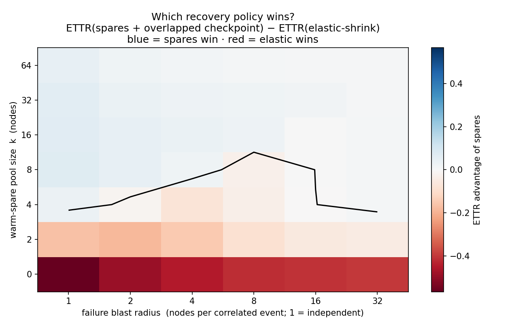
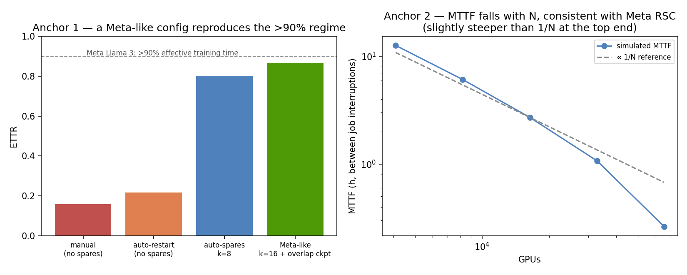

# Reliability Economics: which recovery policy wins in which failure regime

**At scale a GPU cluster faults every few hours, so you will spend on recovery — the question is on *what*.** Warm spares, elastic degradation, frequent checkpointing, faster repair: which one buys the most usable capacity per dollar is not fixed — it depends on your failure process. This repository maps it, with a reproducible simulator that reports the answer in the field's units (ETTR/goodput) and in dollars.

**TL;DR:** the headline is a **phase diagram**, not a number. On a 16,384-GPU training job, no-spares always loses to elastic-shrink; **elastic-shrink is a strong robust default (~0.80)** that beats a tiny spare pool even under independent failures; a **right-sized pool + overlapped checkpointing (k ≈ 8) is the best policy (~0.87), but only in a band and by a thin margin** — and *over-provisioning the pool is charged and hurts*. The gap between a naive and a well-provisioned recovery posture is **~\$21M/month on one cluster**. A Meta-like configuration reproduces Meta's published >90% effective-training-time regime; the model is checked against that and against Meta RSC's MTTF-vs-N scaling.

*Third quantitative pillar of the DIMAGGI series on turning GPU capital into usable compute, and the companion to the [Chaos Fidelity Standard](https://github.com/dimaggi-ai/ai-cluster-chaos-fidelity) — chaos certifies that a recovery behavior works; this prices what it is worth. Full analysis in [docs/study.md](docs/study.md) and the staged preprint [paper/paper.md](paper/paper.md); all claims trace to [REFERENCES.md](REFERENCES.md).*

---

## Why this exists (and why it was rebuilt)

An earlier model reported a single number — "two warm nodes is the biggest lever, 83%." Five independent expert reviews and a [prototype](prototype/) showed that was an artifact of a single-Poisson, policy-independent fault process. This is the rebuild. It fixes five things the critique demanded — shared latent events, correlated failures, a finite spare queue, checkpoint-as-a-policy with write cost, and a realistic elastic cost — and reports the phase map instead of the number. The [v0 baseline](v0-baseline/) is kept for reference and contrast.

## The finding



Blue = warm spares + overlapped checkpoint win; red = elastic-shrink wins. The winner is a *region* of `(failure blast radius × spare-pool size)`, not an ordering. A two-node pool — the thing the old model sold — sits on the losing side of the line for any real blast radius. Details, the crossover, the checkpoint optimum, and the dollar table are in [docs/study.md](docs/study.md).

## Validated against public anchors



A model that cannot reproduce known numbers is a toy. A Meta-like config (right-sized pool, overlapped checkpointing, fast detection) reaches ~0.87 ETTR against Meta's published >90% [1]; MTTF falls with cluster size, consistent with Meta RSC's ∝ 1/N (slightly steeper at the top end) [2]. This also explains why a naive config sits at ~16–22% ETTR while Meta hit >90% on the same hardware — different regime, same model.

## Reproduce

```
pip install -r sim/requirements.txt
make test        # invariants + validation-against-anchors
make figures     # phase diagram, crossover, checkpoint optimum, validation (~1 s)
```

Python 3.11+, `numpy`, `matplotlib`. Seeded and deterministic; checks run in [CI](.github/workflows/ci.yml).

## Honest scope

One gang **training** job (no inter-job scheduling — the [scheduling repo](https://github.com/dimaggi-ai/scheduler-vs-more-gpus); no inference — a different metric); deterministic blast radius and point recovery times; progress linear in usable width above the legal-shape floor. The contribution is the phase structure and the method, validated against anchors; absolute cell values are site-specific. The full "what a skeptic should attack" list is in [docs/study.md](docs/study.md#what-a-skeptic-should-attack) — pre-empting the critique is the point.

## Series — turning GPU capital into usable compute

- **GPU Cluster Networking** ([network-vs-more-gpus](https://github.com/dimaggi-ai/network-vs-more-gpus))
- **GPU Cluster Scheduling** ([scheduler-vs-more-gpus](https://github.com/dimaggi-ai/scheduler-vs-more-gpus))
- **Chaos Fidelity Standard** ([ai-cluster-chaos-fidelity](https://github.com/dimaggi-ai/ai-cluster-chaos-fidelity)) — certifies the experiments
- **Reliability Economics** (this work) — prices which recovery policy wins where
- **Governed Autonomy for GPU Clusters and Networks** (next)

---

*Margaret (Maggie) Nanyonga — Founder & Principal Architect, [DIMAGGI AI](https://dimaggi.ai). Governed AI infrastructure: the control, reliability, and audit layer for autonomous systems operating production networks and compute.*
