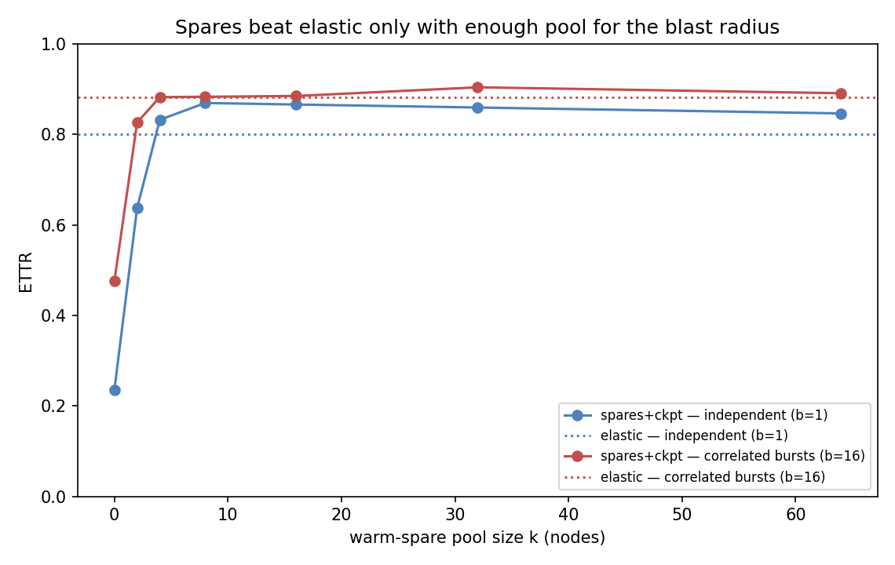
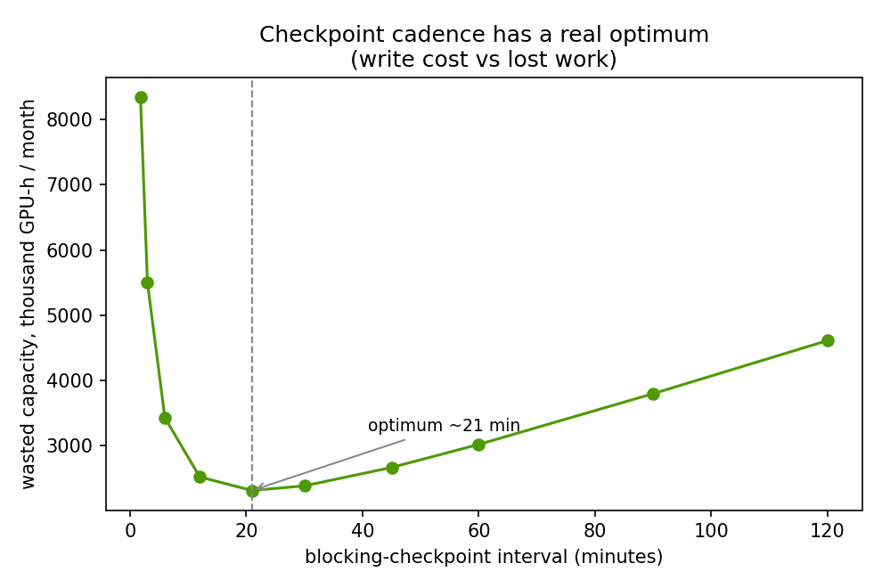

# Reliability economics: which recovery policy wins in which failure regime

Reference numbers point to [REFERENCES.md](../REFERENCES.md). Numbers are means over 8 seeds from [`sim/`](../sim/); reproduce with `python3 sim/run.py`.

## The question, corrected

The naive question — "does faster recovery save GPU-hours?" — has an obvious yes and is not worth a repo. The real question, and the one operators actually face, is: **given that you will spend on recovery, does the win come from warm spares, elastic degradation, frequent checkpointing, or faster repair — and how does the answer change with your failure process?** This study maps that. The headline is not a number; it is a **phase diagram**.

An earlier version of this model (the [v0 baseline](../v0-baseline/), kept for reference) reported a single number — "a two-node warm-spare pool is the biggest lever, 83% capacity." Five independent expert reviews, and a [prototype](../prototype/), showed that finding was an artifact of a single-Poisson, policy-independent fault process. This rebuild fixes the model and reports the map instead.

## What the model does differently

The [simulator](../sim/reliability_sim.py) makes five choices the critique demanded (details in [BUILD_SPEC](../BUILD_SPEC.md)):

1. **Shared latent events, not policy-conditioned interruptions.** Hardware faults occur on one absolute-time timeline per seed; every policy faces the *same* faults and differs only in detection and recovery. Interruptions are an *output*, not the input — so a policy that recovers well genuinely experiences fewer job stops, and no policy is scored against another's interruption stream.
2. **Correlated failures.** A base rate of single-node faults plus rarer common-cause bursts (rack/PDU/switch) that take out a *blast radius* of nodes at once. Independent Poisson is the blast-radius-1 special case.
3. **Spares as a finite queue** with four clocks — failover, repair, requalification, return-to-pool. A used spare is unavailable for hours; the pool can be exhausted. This is what the v0 "always-sufficient pool" got wrong.
4. **Checkpoint as a policy lever with a write cost.** Frequent checkpointing cuts lost work but costs write stalls; overlapped (async) checkpointing hides most of the stall — the ByteRobust regime [3], as the checkpoint-systems literature (CheckFreq, Gemini, just-in-time checkpointing) established [4]. There is a real Young/Daly optimum [5].
5. **Elastic-shrink is not free** — a reshard/communicator-rebuild stop per event plus a legal-shape tax (you shrink to whole data-parallel replicas), so usable capacity drops to the next legal shape, not by one node.

Metrics are the field's: **ETTR** (effective training time ratio = productive ÷ envelope, ≈ Meta's metric [2]) as the headline, MTTF/MTTR/availability as diagnostics, and a **dollar layer** so a reserved spare is a cost, not just a waste category.

## The phase diagram

Reading it (blue = warm spares + overlapped checkpoint win; red = elastic-shrink wins):

- **No spares (k = 0) always loses to elastic.** Idling the fleet for every repair is the worst posture there is (16–24% ETTR); if you hold no reserve, degrade gracefully instead.
- **Elastic-shrink is a strong, robust default (~0.80).** It needs no reserved pool, degrades to the next legal shape, and beats a spare pool at small k and under large bursts — a two-node pool (the v0 "biggest lever") *loses to elastic even under independent failures*.
- **A right-sized pool + overlapped checkpointing (k ≈ 8) is the best policy (~0.87) — but only in a band, and by a thin margin over elastic.** The pool must match the blast radius: too small and it collapses to the repair wait; too large and the idle reservation — now charged to the envelope — drags ETTR back down (k = 32 scores *below* k = 8). Overlapped checkpointing is the co-lever that makes the spare policy the winner at all.
- **The winner is a region, not an ordering, and the winning margin is thin.** That honesty is the finding: recovery strategy is a design choice against your failure process; elastic is competitive almost everywhere; spares earn their keep only when right-sized to the blast radius.

## The economics

Priced at \$2.50/GPU-hour on the 16,384-GPU fleet, with the reserved spare pool charged into the envelope (a pool you hold out is a cost, not a free safety margin), the monthly cost of the *wrong* recovery posture is severe:

| Policy (independent failures) | ETTR | Wasted \$/month |
|---|---|---|
| manual (page a human, no spares) | 0.16 | ~\$24.8M |
| auto-restart (no spares) | 0.22 | ~\$23.1M |
| elastic-shrink (no pool) | 0.80 | ~\$5.9M |
| auto-spares, right-sized k = 8 | 0.80 | ~\$5.8M |
| auto-spares + overlapped checkpoint, k = 8 | 0.87 | ~\$3.9M |

The spread between a naive posture and a well-provisioned one is **~\$21M/month on one training cluster** — the number a budget owner needs, and one no amount of additional GPU purchasing recovers per dollar. Note the ordering: automated recovery of *any* kind (elastic or right-sized spares) is worth ~\$18M/month over paging a human; the further step to the best policy is another ~\$2M. The checkpoint cadence alone has a real optimum:

## Validation against published anchors

A model that cannot reproduce known numbers is a toy. Detection time — the gap between the ~30 s InfiniBand transport timeout and the 600 s PyTorch watchdog [7] — is one swept input; the model is checked against two published anchors:

- **Anchor 1 — Meta's >90% ETTR.** A Meta-like configuration (a right-sized spare pool, overlapped checkpointing, fast detection) reproduces ~0.87 ETTR, just under Meta's published >90% effective training time on the Llama 3 405B run [1]. This also answers the obvious objection: the naive policies score ~16–22% not because 16k-GPU training is hopeless, but because Meta ran the *Meta-like* config, not manual-ops — the model reproduces both ends.
- **Anchor 2 — Meta RSC's MTTF vs N.** Sweeping cluster size, MTTF between job interruptions falls with GPU count, consistent with Meta RSC's ∝ 1/N scaling — though slightly *steeper* than 1/N at the top end (a doubling ratio approaching ~2.9× rather than 2×), which is the expected direction for real fleets and which the model does not tune to fit [2]. Treat this as a consistency check on the direction and rough magnitude, not a fitted validation.

## What a skeptic should attack

Stated plainly, because pre-empting the critique is the point:

- **Deterministic blast radius and point recovery times.** Real bursts vary in size and real repair/requal/reshard times are distributions with heavy tails; this model uses fixed values. The phase *structure* is robust to this; exact cell values are not.
- **Progress is linear in usable width above the legal-shape floor.** Real elastic training has pipeline-bubble and batch-size effects that make progress sub-linear; the reshard cost and legal-shape tax capture the first-order penalty, not all of it.
- **One gang training job, no inter-job scheduling** (that is the [scheduling repo's](https://github.com/dimaggi-ai/scheduler-vs-more-gpus) [9] subject) and **no inference** (serving reliability is a different metric — error budget, not ETTR).
- **SDC and stragglers are regimes, not devices, here.** Their *economic* effect (SDC [6] can invalidate the last good checkpoint; a straggler taxes every step) is representable by parameters; their detection is the [chaos-fidelity standard's](https://github.com/dimaggi-ai/ai-cluster-chaos-fidelity) [8] subject.
- **The failure rate rests on public snapshots.** The base rate is calibrated to Llama 3 [1] and cross-checked against Meta RSC [2]; a site should re-point `Config` to its own numbers. The ordering is insensitive to the exact rate; the dollar magnitudes are not.

## What it is

A structural, regime-aware comparison of recovery policies in the field's units, validated against public anchors, priced in dollars — and honest about which of its inputs a reader should push on. The contribution is the map and the method, not any single cell. Invariants (metric bounds, the availability relationship, shared-event determinism, and the two anchors) are enforced by [tests](../sim/test_reliability_sim.py).
